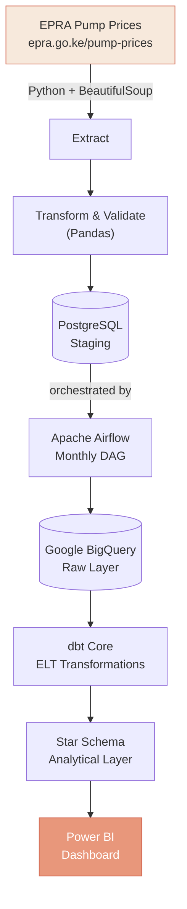
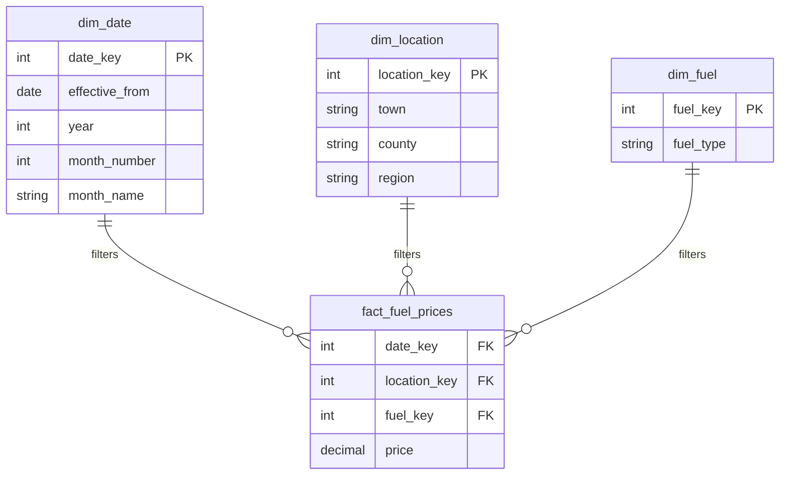

<div align="center">

# EPRA Fuel Intelligence

### An end-to-end data engineering pipeline for Kenya's national fuel price data

_From a raw government web table to a governed analytical warehouse and a branded Power BI dashboard._


</div>

---

## Overview

Kenya's Energy and Petroleum Regulatory Authority (EPRA) publishes pump prices for **223+ towns** every pricing cycle — but the data lives in an unindexed web table with no API, no historical archive, and no way to ask "how has this changed over time" without manually checking month by month.

This project turns that raw public data into a governed, queryable analytical asset: a scheduled pipeline extracts and validates the data, stages it in PostgreSQL, loads it into a cloud warehouse, models it into a proper star schema, and serves it through a Power BI dashboard built from a custom design system — not a template.

It's built the way a production pipeline would be, at portfolio scale: containerized infrastructure, orchestrated scheduling, idempotent loads, automated data-quality checks, and a warehouse layer that's the _only_ thing the BI layer is allowed to touch.

---

## Dashboard Preview


_Interactive Power BI executive overview featuring core KPI metrics, EPRA step-line price trends, top location price rankings, dynamic slicers, and spatial density heat-mapping across Kenya._

---

## What this project demonstrates

| Area                         | What's implemented                                                                                                                                          |
| ----------------------------- | -------------------------------------------------------------------------------------------------------------------------------------------------------- |
| **Data extraction**          | Resilient web scraping (`requests` + `BeautifulSoup`) with a local-sample fallback for offline development                                                 |
| **ETL / ELT design**         | Clean separation of extract → transform → validate → load stages, each independently testable                                                             |
| **Data quality engineering** | Automated checks for nulls, duplicates, positive prices, valid date ranges, and referential integrity — pipeline fails loudly rather than loading bad data |
| **Infrastructure as code**   | Multi-service `docker-compose.yml` (Postgres, Airflow webserver/scheduler/metadata DB) — fully reproducible from a clean machine                           |
| **Workflow orchestration**   | Apache Airflow DAG with task-level retries, dependency chaining, and a monthly schedule aligned to EPRA's actual publication cadence                       |
| **Cloud data warehousing**   | Google BigQuery as the analytical store, loaded from the Postgres staging layer                                                                            |
| **Dimensional modeling**     | Kimball-style star schema (`dbt Core`) — a fact table at a clean grain plus conformed date/location/fuel dimensions                                        |
| **BI development**           | Multi-page Power BI report with a custom theme, DAX measure library, dynamic titles, and a purpose-built logo — not the default Power BI look              |

---

## Architecture



---

## Data Model

The analytical layer is a Kimball-style star schema — `fact_fuel_prices` holds one row per **town + fuel type + pricing period**, everything else is a conformed dimension.



**Grain:** One fuel price observation, for one location, for one fuel type, for one effective pricing period.

---

## Tech Stack

| Layer               | Technology                          |
| -------------------- | ------------------------------------ |
| Extraction          | Python, `requests`, `BeautifulSoup` |
| Exploration         | Jupyter Notebook                    |
| Processing          | Pandas                              |
| Operational staging | PostgreSQL                          |
| Containerization    | Docker / Docker Compose             |
| Orchestration       | Apache Airflow                      |
| Cloud warehouse     | Google BigQuery                     |
| Transformation      | dbt Core                            |
| BI / Reporting      | Power BI                            |
| Version control     | Git / GitHub                        |

---

## Data Quality

Every load is validated before it's trusted downstream:

- No null values in required fields
- No duplicate rows at the fact grain ( `town`, `fuel_type`)
- All prices strictly positive
- Valid, non-overlapping effective date ranges
- Referential integrity against `dim_location` and `dim_fuel`
- Idempotent loads — re-running the pipeline against unchanged source data inserts **zero** duplicate rows (`ON CONFLICT DO NOTHING`, with actual insert counts tracked, not just rows submitted)

---

## Project Structure

```text
epra-fuel-data-pipeline/
├── airflow/
│   └── dags/
│       └── epra_fuel_prices_dag.py
├── credentials/               # [Ignored by Git]
├── data/
├── epra_warehouse/            # dbt project
├── notebooks/
├── src/
│   ├── epra_extractor.py
│   ├── epra_transformer.py
│   ├── epra_validator.py
│   ├── postgres_loader.py
│   ├── bigquery_loader.py
│   └── pipeline.py
├── Power-Bi Dashboard.png
├── docker-compose.yml
├── requirements-airflow.txt
├── requirements.txt
├── .env.example
└── README.md
```

---

## Getting Started

**1. Clone and enter the project**

```bash
git clone https://github.com/shawnmacharia/epra-fuel-data-pipeline.git
cd epra-fuel-data-pipeline
```

**2. Create and activate a virtual environment**

```bash
python -m venv .venv
.venv\Scripts\Activate.ps1        # Windows PowerShell
```

**3. Install dependencies**

```bash
pip install -r requirements.txt
```

**4. Configure environment variables**

```bash
cp .env.example .env
```

Fill in your own values. **Never commit** `.env`, GCP service-account credentials, passwords, or API keys.

**5. Start the local infrastructure**

```bash
docker compose up -d
docker compose ps      # confirm every service is Up/healthy
```

**6. Run the pipeline**

```bash
python -m src.pipeline
```

**7. Orchestrate via Airflow**

Open `http://localhost:8080`, trigger the `epra_fuel_prices_pipeline` DAG.

**8. Build the warehouse layer**

```bash
cd epra_warehouse
dbt debug
dbt build
```

---

## Roadmap

**Completed**

- [x] Live EPRA extraction (resilient scraping, sample fallback)
- [x] Pandas transformation & validation suite
- [x] PostgreSQL staging with idempotent upserts
- [x] Dockerized infrastructure (Postgres + Airflow)
- [x] Airflow DAG with task-level orchestration and retries
- [x] Power BI executive dashboard with custom theme, DAX library, and spatial heat map
- [ ] BigQuery ingestion from the Postgres staging layer
- [ ] dbt star schema (`dim_date`, `dim_location`, `dim_fuel`, `fact_fuel_prices`)
- [ ] Multi-page dashboard navigation build-out
- [ ] CI/CD for pipeline and dbt changes
- [ ] Monitoring and failure alerting
- [ ] Historical EPRA dataset backfill

---

## Author

**Shawn Macharia Mugambi**
Data Analyst / Data Engineer

[GitHub](https://github.com/shawnmacharia)

---

## Disclaimer

This project is built for educational and portfolio purposes. Source data belongs to the Energy and Petroleum Regulatory Authority (EPRA) and should be used according to their terms.
