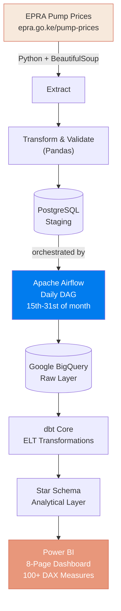
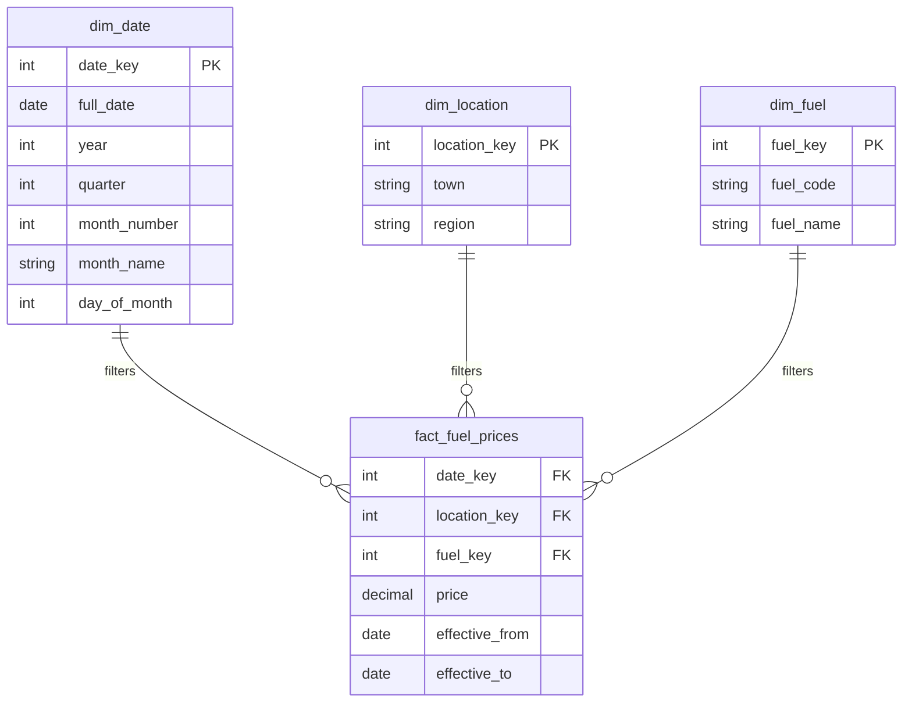

<div align="center">

# EPRA Fuel Intelligence

### An end-to-end data engineering pipeline for Kenya's national fuel price data

_From a raw government web table to a governed analytical warehouse and a branded Power BI dashboard._


</div>

---

## 🎯 Project Status: PRODUCTION READY ✅

This is a **complete, end-to-end data engineering project** that transforms Kenya's fuel price data from EPRA's website into actionable business intelligence through a professionally built Power BI dashboard.

---

## Overview

Kenya's Energy and Petroleum Regulatory Authority (EPRA) publishes pump prices for **223+ towns** every pricing cycle — but the data lives in an unindexed web table with no API, no historical archive, and no way to ask "how has this changed over time" without manually checking month by month.

This project turns that raw public data into a **governed, queryable analytical asset**: 
- A **resilient containerized pipeline** extracts and validates data daily (15th-31st of each month, aligned to EPRA releases)
- Data stages in **PostgreSQL** with automated quality checks
- **Apache Airflow** orchestrates the workflow with retries and dependency chaining
- **Google BigQuery** serves as the cloud warehouse
- **dbt** models the data into a Kimball-style **star schema** (fact + dimensions)
- **Power BI** delivers a multi-page interactive dashboard with 100+ DAX measures

---

## 📊 Power BI Dashboard

**Location:** `Power Bi/EpraFuelDashboard.pbix` and `Power Bi/EpraFuelDashboard.pdf`

### Features:
✅ **8-Page Interactive Dashboard:**
1. **Executive Dashboard** - KPI cards, MoM changes, affordability index, heat map
2. **Trends & Forecasting** - Historical trends, 3-cycle forecast with confidence bands, volatility
3. **Regional Benchmarking** - Regional heatmap, outlier detection, price variance analysis
4. **Location Deep Dive** - Town-by-town ranking, comparative analysis, percentile tracking
5. **Affordability Analysis** - Consumer impact metrics, fill-up cost tracking, regional affordability scores
6. **Supply Chain** - Transport cost impact, regional premiums, distribution analysis
7. **Executive Summary** - Print-ready single-page report with key insights
8. **Data Quality Monitor** - Pipeline health, data completeness, anomaly tracking

### DAX Measures:
- 100+ DAX measures organized in 16 categories
- Includes: MoM changes, percentile ranks, volatility, forecasting, anomaly detection, affordability indices
- Real-time refresh from BigQuery (daily, 15th-31st of each month)

### Interactivity:
- Multi-level filtering (Fuel Type, Region, Town, Date Range)
- Drill-through pages for detailed analysis
- Advanced tooltips with sparklines
- Bookmarks for common use cases
- Conditional formatting with status indicators

---

## 🏗️ Architecture



---

## 📈 Data Model

Kimball-style star schema with **fact_fuel_prices** at grain: **town × fuel type × pricing period**



---

## ✨ What This Project Demonstrates

| Area | Implementation |
|------|-----------------|
| **Data Extraction** | Resilient web scraping (cloudscraper + BeautifulSoup) with fallback to sample data |
| **ETL/ELT Design** | Clean separation: Extract → Transform → Validate → Load (each independently testable) |
| **Data Quality** | Automated null/duplicate/range checks; idempotent upserts; referential integrity |
| **IaC** | Multi-container Docker Compose (Postgres, Airflow webserver/scheduler/metadata DB) |
| **Orchestration** | Apache Airflow DAG with task retries, dependency chaining, daily schedule (15th-31st) |
| **Cloud Warehouse** | Google BigQuery with time partitioning and clustering for performance |
| **ELT Modeling** | dbt Core star schema with automated dbt tests |
| **BI Development** | Production-grade Power BI: custom theme, 100+ DAX measures, multi-page drill-through |
| **Network Optimization** | Removed DNS overrides for proper cloudscraper firewall bypass |
| **Continuous Refresh** | DAG triggers daily during pricing window; Power BI refreshes automatically |

---

## 🔧 Tech Stack

| Layer | Technology |
|-------|-----------|
| **Extraction** | Python, cloudscraper, BeautifulSoup |
| **Processing** | Pandas, NumPy |
| **Staging** | PostgreSQL 16 |
| **Orchestration** | Apache Airflow 2.9 |
| **Containerization** | Docker, Docker Compose |
| **Cloud Warehouse** | Google BigQuery |
| **Transformation** | dbt Core |
| **BI/Analytics** | Power BI (Desktop + Service) |
| **Version Control** | Git, GitHub |

---

## 📁 Project Structure

```
epra-fuel-data-pipeline/
├── airflow/
│   ├── dags/
│   │   └── epra_fuel_prices_dag.py          # Daily DAG (15th-31st)
│   ├── logs/                                 # [Generated at runtime]
│   └── Dockerfile
├── epra_warehouse/                           # dbt project
│   ├── models/
│   │   ├── staging/
│   │   │   └── stg_epra_fuel_prices.sql
│   │   ├── dimensions/
│   │   │   ├── dim_date.sql
│   │   │   ├── dim_location.sql
│   │   │   └── dim_fuel.sql
│   │   ├── facts/
│   │   │   └── fact_fuel_prices.sql
│   │   └── schema.yml
│   ├── dbt_project.yml
│   └── README.md
├── src/
│   ├── epra_extractor.py                    # Download EPRA data
│   ├── epra_transformer.py                  # Clean & standardize
│   ├── epra_validator.py                    # Data quality checks
│   ├── postgres_loader.py                   # Stage to PostgreSQL
│   ├── postgres_reader.py                   # Read for BigQuery
│   ├── bigquery_loader.py                   # Load to BigQuery
│   ├── pipeline.py                          # Orchestrate locally
│   └── config.py                            # Configuration
├── Power Bi/
│   ├── EpraFuelDashboard.pbix               # Power BI model (8 pages, 100+ measures)
│   └── EpraFuelDashboard.pdf                # Exported dashboard report
├── data/
│   ├── raw/                                 # [Git-ignored]
│   ├── processed/                           # [Git-ignored]
│   └── samples/
│       └── epra_sample.html                 # Fallback for offline development
├── notebooks/                                # Jupyter exploration
├── dbt/
│   └── profiles/                            # dbt config
├── docker-compose.yml                       # Multi-service orchestration
├── requirements.txt                         # Python dependencies
├── requirements-airflow.txt                 # Airflow-specific dependencies
├── .env.example                             # Template for secrets
├── .gitignore                               # Excludes credentials, data, cache
└── README.md                                # This file
```

---

## 🚀 Quick Start

### Prerequisites
- Docker & Docker Compose
- Python 3.10+
- GCP account with BigQuery project
- Power BI Desktop (optional, for editing)

### 1. Clone & Setup

```bash
git clone https://github.com/shawnmacharia/epra-fuel-data-pipeline.git
cd epra-fuel-data-pipeline

# Create virtual environment
python -m venv .venv
.venv\Scripts\Activate.ps1        # Windows PowerShell
source .venv/bin/activate          # Linux/macOS

# Install dependencies
pip install -r requirements.txt
```

### 2. Configure Environment

```bash
cp .env.example .env
```

Edit `.env` with your GCP credentials:
```
GCP_PROJECT_ID=your-project-id
POSTGRES_PASSWORD=your-password
```

### 3. Start Infrastructure

```bash
docker compose up -d
docker compose ps        # Verify all services are healthy
```

### 4. Run Pipeline Locally

```bash
# One-time execution
python -m src.pipeline

# Or trigger via Airflow UI
# http://localhost:8090 (admin/admin)
```

### 5. Build Data Warehouse

```bash
cd epra_warehouse
dbt debug
dbt build
```

### 6. Connect Power BI

1. Open `Power Bi/EpraFuelDashboard.pbix`
2. **Home → Transform Data → Data source settings**
3. Update BigQuery connection to your GCP project
4. Refresh the dashboard
5. The dashboard will show live data from BigQuery

---

## 📅 Scheduling

**DAG Schedule:** `0 0 15-31 * *` (Daily at midnight, 15th-31st of each month)

This aligns with EPRA's pricing cycle:
- **15th:** EPRA releases new prices → DAG runs and loads data
- **16th-31st:** DAG runs daily, checks for any updates
- **1st-14th:** No runs (old pricing cycle, awaiting next release)

In production, set Power BI to refresh hourly or daily from BigQuery for real-time updates.

---

## ✅ Data Quality

Every load is validated before it reaches the warehouse:

✅ No null values in required fields  
✅ No duplicate rows at fact grain (town, fuel_type, date)  
✅ All prices strictly positive (>0)  
✅ Valid, non-overlapping effective date ranges  
✅ Referential integrity against dim_location and dim_fuel  
✅ Idempotent loads (re-running = zero duplicate rows)  

Failed validations **stop the pipeline** and trigger alerts.

---

## 🎓 Learning Outcomes

This project is a **portfolio showcase** demonstrating:

1. **Full-Stack Data Engineering:** Extraction → Transformation → Warehousing → BI
2. **Cloud Best Practices:** BigQuery partitioning, clustering, cost optimization
3. **Modern Analytics:** Kimball modeling, dbt testing, DAX calculations
4. **DevOps:** Docker, Airflow DAG orchestration, IaC principles
5. **Software Engineering:** Clean code, error handling, logging, CI-ready structure

---

## 🔄 Updates & Maintenance

### Daily Refresh
```bash
# Airflow automatically triggers 15th-31st of each month
# No manual intervention needed
```

### Monthly Backfill (if needed)
```bash
# Run historical data load
# See epra_warehouse/README.md for dbt commands
```

### Power BI Refresh
```
Power BI Service → Refresh schedule
Set to: Daily at 2 AM (after pipeline completes at midnight)
```

---

## 📝 Roadmap

**✅ Completed**
- [x] Live EPRA extraction with cloudscraper
- [x] Pandas transformation & validation
- [x] PostgreSQL staging layer
- [x] Apache Airflow orchestration (daily, 15th-31st)
- [x] Google BigQuery warehouse
- [x] dbt star schema
- [x] Power BI 8-page dashboard (100+ DAX measures)
- [x] Network optimization (DNS fix)
- [x] Production-ready project structure

**🚧 Future Enhancements**
- [ ] CI/CD pipeline (GitHub Actions)
- [ ] Data anomaly alerting (Slack integration)
- [ ] Historical backfill UI
- [ ] Cost optimization dashboard
- [ ] Mobile Power BI app
- [ ] Predictive pricing model (ML)

---

## 👨‍💻 Author

**Shawn Macharia Mugambi**  
Data Analyst / Data Engineer  
🔗 [GitHub](https://github.com/shawnmacharia) | 🔗 [LinkedIn](#)

---

## 📄 License

This project is built for educational and portfolio purposes. Source data belongs to Kenya's Energy and Petroleum Regulatory Authority (EPRA) and should be used according to their [terms and conditions](https://www.epra.go.ke).

---

## 🙏 Acknowledgments

- **EPRA** for publishing public fuel price data
- **Apache Airflow** for reliable orchestration
- **dbt** for the transformation framework
- **Power BI** for enterprise analytics

---

**Last Updated:** September 2026  
**Status:** Production Ready ✅
